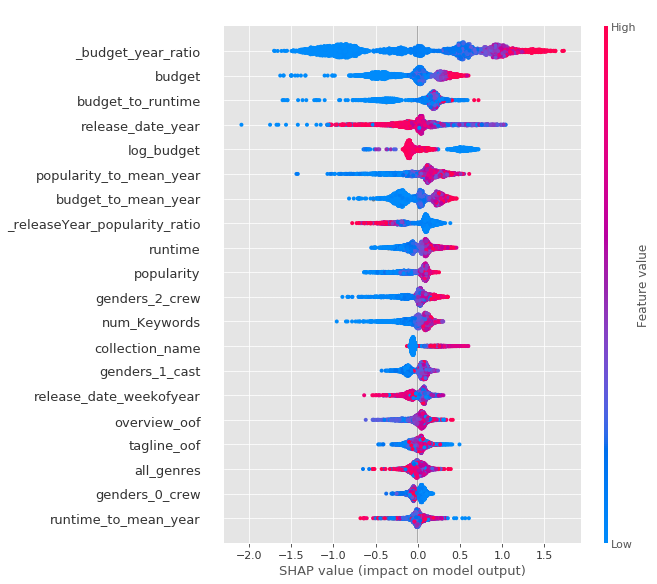

# Kaggle: TMDB Box Office Prediction ([link](https://www.kaggle.com/c/tmdb-box-office-prediction))

__Data__: 7 398 movies with a variety of metadata

__Task__: predict movie's overall box office revenue

__Evaluation__: Root-Mean-Squared-Logarithmic-Error (RMSLE)

__Solution__: prediction averaging over XGBoost and CatBoost

__Success__: 2.03 RMSLE

